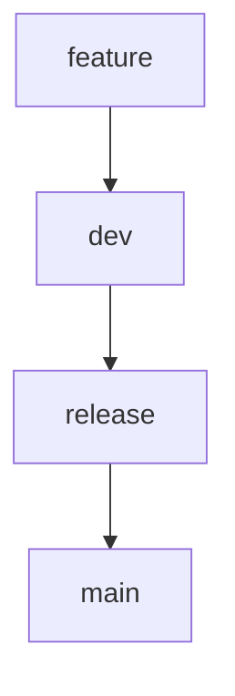

# 🪄 Git 브랜치 전략 가이드

## 🔁 브랜치 구조

| 브랜치          | 설명                                                                             |
| --------------- | -------------------------------------------------------------------------------- |
| `main`          | 🚀 **배포 대상 브랜치**입니다. `npm publish`는 이 브랜치에 머지될 때 실행됩니다. |
| `dev`           | 🧪 **개발 브랜치**입니다. 기능을 병합하고 릴리즈 준비를 진행합니다.              |
| `feature/*`     | ✨ 기능 개발용 브랜치입니다. 예: `feature/use-dialog`                            |
| `release/x.y.z` | 🧾 릴리즈 준비용 브랜치입니다. 예: `release/1.0.0`                               |

---

## 🔃 브랜치 흐름 예시

---

## 📦 커밋 메시지 규칙

이 프로젝트는 [Conventional Commits](https://www.conventionalcommits.org/en/v1.0.0/)을 사용합니다:

예시:

- `feat: useDialog 훅 추가`
- `fix: dialog 닫힘 오류 수정`
- `chore: eslint 제거 및 biome 설정`

---

## 📁 관련 파일

- [COMMIT_GUIDE.md](./COMMIT_GUIDE.md): 커밋 메시지 규칙 참고

---
